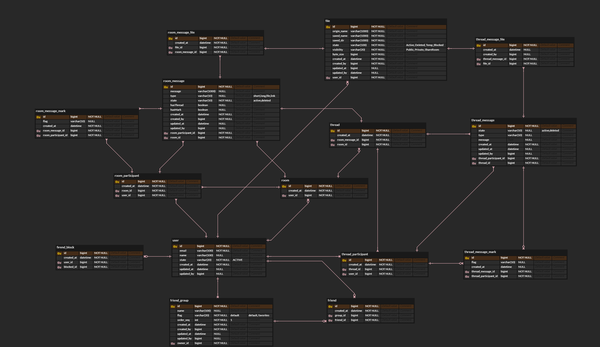

# [Toy Project] simple-chat-api 
현재 구상중..

- 간단한 채팅 서버
- 유저 클라이언트 제외 

## Tech stack 
현재 구상중.. 
 
1. spring boot + web mvc, validator, actuator
2. spring data + jpa & querydsl
3. mapstruct
4. spring data redis
4. express, socket.io
5. h2, mysql
6. aws ec2, nginx, s3, redis, codedeploy
7. github repo, github action
8. nosql(채팅 메시지는 document 로 관리 할까 고민중..) 

## 아키텍처 설계
현재 구상중..
- websocekt + redis 는 event 신호 정도만 전달 
 

### 고려사항
1. socket.io max connection per node and server
2. socket.io max room per namespace
3. pm2 or docker for node - 어떤 방식을 할지... 
4. docker or not for spring - 어떤 방식을 할지...
5. nginx stick session max connection   
6. api server 부하 테스트 jmeter? ngrinder? 


## ERD
현재 구상중..



## event message foramt
### topic
#### client 
- emit : event.client
- listen : event.server  
#### server
- emit : event.server
- listen : event.client

### 연결 요청 (ex. browser)
모든 web-socket 연결은 반드시 header에 jwt 토큰 필요
#### 요청 포맷
Topic : event.client

##### chat connect
```json
{
  "type" : "chat",
  "roomId" : "room-uuid"
}
```
##### person connect
```json
{
  "type" : "person",
  "userId" : "user-uuid"
}
```
##### base connect
```json
{
  "type" : "all"
}
```

### 연결 응답 
Topic : event.server

(note: websocket 요청의 jwt 유효성 확인)

#### 성공 응답 포맷 

##### chat 
```json
{
  "type": "chat",
  "roomId" : "room-uuid",
  "msg": "connection success",
}
```

##### person
```json
{
  "type": "person",
  "userId" : "user-uuid",
  "msg": "connection success",
}
```

##### all
```json
{
  "type": "all",
  "msg": "connection success",
}
```


### redis publish format
(api server)

```text
{
    "relay-type" : "chat | person | all",
    "[roomId]" : "room-uuid",
    "[userId]" : "user-uuid",
    "timestamp" : "utc time",
    "msg-type" : 
        // if relay-type : room  
        ["room.msg.new | room.person.in | room.person.out | ..."]
        
        // if relay-type : person
        ["person.invited | person.payment | ..."]
        
        // if relay-type : all
        ["all.service-check | all.biz-event | all.new-feature | ..."] 
}

```
 


