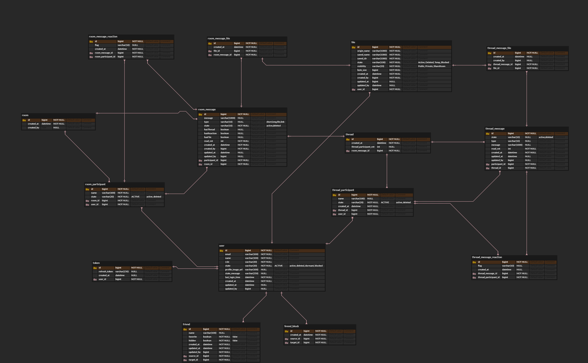

# [Toy Project] simple-chat-api 
- 간단한 채팅 서버
- 유저 클라이언트 제외 

## TODO
1. redis local test 환경 구축

## Tech stack 
1. api server 
    - spring boot mvc 
    - spring validator 
    - spring actuator
    - spring data jpa
    - querydsl
    - mapstruct
    - h2, mysql
        - mysql replication(rw, ro) 
    - spring data redis
    - nginx : RR
2. socket server
    - node + express
    - socket.io
    - nginx : sticky session
3. Redis
    - Cluster (try? nope) 
4. Github Repo + Action, Codedeploy
5. NoSQL(Try to manage chat messages by NoSQL? nope) 
6. docker    
    - 로컬 개발환경 인프라 구성 docker-compose
    - mysql replication
    - redis
    - nginx * 2

## 아키텍처 설계
현재 구상중..
- websocekt + redis 는 event 신호 정도만 전달 
 

### 고려사항
1. socket.io max connection per node and server
2. socket.io max room per namespace
3. pm2 or docker for node - 어떤 방식을 할지... 
4. docker or not for spring - 어떤 방식을 할지...
5. nginx sticky session max connection   
6. api server 부하 테스트 jmeter? ngrinder? 

## ERD
현재 구상중..

### 고려사항
1. 디비 테이블 별 소프트 fk와 물리 fk 결정
2. 디비 테이블 별 소프트 삭제와 물리 삭제 결정, casecade도 같이 고려
3. message 테이블은 record가 엄청 많을건데... 어떻게 관리하지? table 파티션? nosql scale out? 

## 기능
- 유저 
  - 가입 ⭕
  - 탈퇴 ⭕ 
  - 수정
    - 이름 ⭕
    - 프로필 사진 ⭕
  - 자기 정보 가져오기 ⭕
- 토큰 
  - 발급 ⭕
  - 재발급 ⭕
- 친구 
  - 추가 ⭕ 
  - 삭제 ⭕  
  - 차단  
    - 추가 ⭕
    - 취소(삭제) ⭕
    - 차단 목록 ⭕
  - 숨긴 (친구 정보 수정으로 처리)
    - 추가 ⭕
    - 취소 ⭕
    - 숨긴 목록 ⭕ 
  - 즐겨찾기 ⭕  
    - 추가 ⭕
    - 취소 ⭕
    - 즐겨찾기 목록 ⭕ 
  - 친구 이름 변경 (친구 정보 수정으로 처리) ⭕ 
  - 톡하기
    - 대화방 열기
  
- 방
  - 만들기 ⭕
  - 나가기
  - 친구 초대
    - 차단된 친구의 초대는 허용하지 않음
  - 메시지 
    - 발송
      - 단문/장문/파일(문서,이미지,음성,영상)
      - 내가 보낸 메시지 삭제 
    - 수신
      - 접근 기기의 마지막 메시지 번호로 부터 가장 최신 메시지들 수신
      - 확인하지 않은 새로운 메시지 개수 표시  
    - reaction 표시
    - 알림
      - 방마다 알림 차단 설정
- 쓰레드
  - 만들기
  - 나가기
  - 참여하기(초대 없음)
  - 메시지
    - 발송
      - 단문/장문/파일(문서,이미지,음성,영상)
      - 내가 보낸 메시지 삭제 
    - 수신
      - 접근 기기의 마지막 메시지 번호로 부터 가장 최신 메시지들 수신
      - 확인하지 않은 새로운 메시지 개수 표시
    - reaction 표시
    - 알림
      - 방마다 알림 차단 설정
   
  
