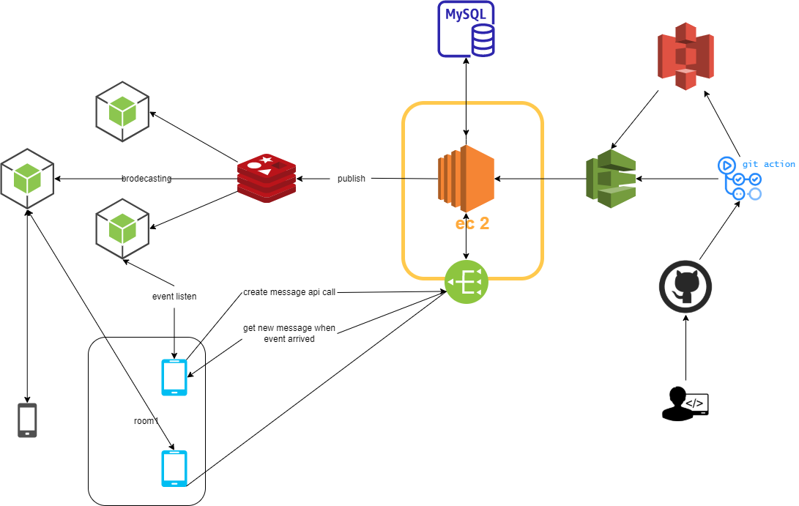

# toy project
구상중...

## simple-chat-api 
event를 통해서는 신호 정도만 전달 받음. 실제 데이터 전달은 api로 전달하는 구조로 구상중.  

- client와 socket 연결은 node의 socket.io 나 spring stomp 둘중 고려중.  
- api 서버는 spring boot 로 결정


### 구상

[이미지 참조](https://velog.io/@tigger/Github-Action%EA%B3%BC-AWS-S3-%EC%97%B0%EB%8F%99%ED%95%98%EA%B8%B0) 


## event message foramt

### web-socket 연결
#### client
- emit : event.client
- listen : event.server  

#### server
- emit : event.server
- listen : event.client


### 연결 요청 (ex. browser)
모든 web-socket 연결은 반드시 header에 jwt 토큰 필요

#### 요청 포맷
Topic : event.client

##### chat connect
```json
{
    "type" : "chat",
    "roomId" : "room-uuid",
    "msg" : "room connection request"
}
```
##### person connect
```json
{
    "type" : "person",
    "userId" : "user-uuid",
    "msg" : "person connection request"
}
```
##### base connect
```json
{
    "type" : "all",
    "msg" : "default connection request"
}
```

### 연결 응답 
Topic : event.server

(note: websocket 요청의 jwt 유효성 확인)

#### 성공 응답 포맷 

##### chat 
```json
{
    "type": "chat",
	"roomId" : "room-uuid",
    "msg": "connection success",
}
```

##### person
```json
{
    "type": "person",
	"userId" : "user-uuid",
    "msg": "connection success",
}
```

##### all
```json
{
    "type": "all",
    "msg": "connection success",
}
```


### redis publish format
(api server)

```text
{
	"relay-type" : "chat | person | all",
	"[roomId]" : "room-uuid",
	"[userId]" : "user-uuid",
	"timestamp" : "utc time",
	"msg-type" : 
        // if relay-type : room  
	    ["room.msg.new | room.person.in | room.person.out"]
      
        // if relay-type : person
        ["person.invited | person.payment"]

        // if relay-type : all
        ["all.service-check | all.biz-event | all.new-feature"] 
}

```

### 현재 구상한 tech stack
1. spring boot + web mvc, validator, actuator
2. spring data + jpa & querydsl
3. websocket : spring stomp or node socket.io 둘 중 고민중
3. mapstruct
4. h2, mariadb
5. aws ec2, nginx, s3


